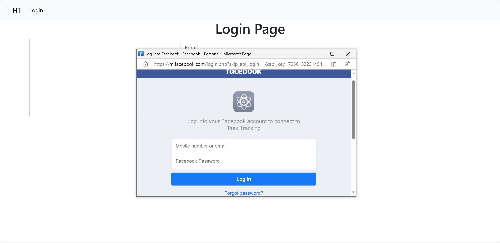
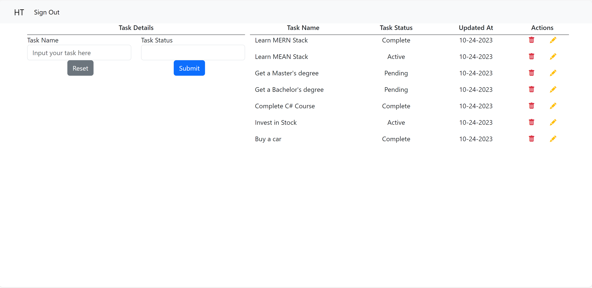
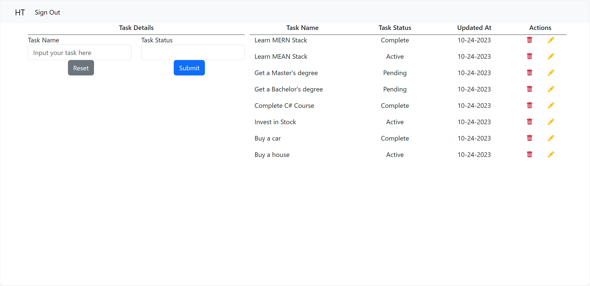
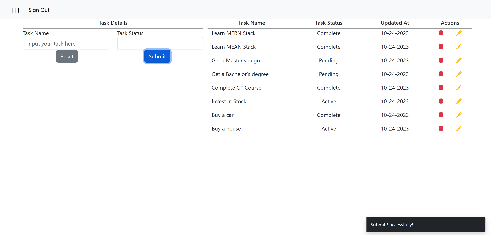
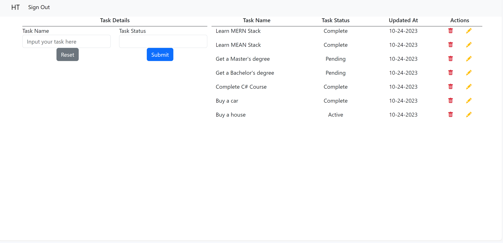
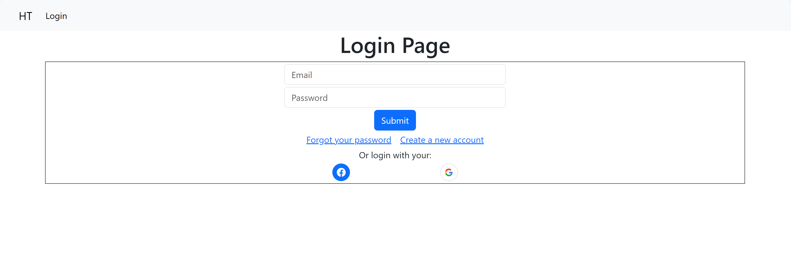
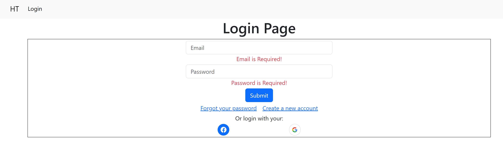

# Frontend

This project was generated with [Angular CLI](https://github.com/angular/angular-cli) version 16.2.4.

When the user is logged in or has created a new account, the user will be redirected to the homepage, where the user can use the services. The navigation bar also will be updated to allow the user to sign out.

The services allow the user to add new tasks with task status by clicking Submit button. To notify user knowing that the task list has been updated, the toast message will popup.

Or, user can edit and update existing tasks by clicking a yellow pencil icon on the right-hand side. In this example, the "Learn MEAN Stack" task's status is changed from "Active" to "Complete."

Or, user can delete the existing task by clicking a red bin icon on the right-hand side. In this example, the "Invest in Stock" task is deleted.

The User can sign out by clicking "Sign Out" button on the Nav bar. Then, the user will be redirected to Login Page, and the "Sign Out" button is changed to "Login" button.

At the Login Page, the user can sign in with email and password. If the email or password is missing, the notification will be showed.

Or, if the email format is incorrect, the "Email is Invalid" notification will be displayed as well.

If the user doesn't have an account, the user can create on by clicking on "Create a new account." This will redirect the user to the Register Page. In this page, the user can create an account by input user's full name, email, and password. These fields are required and will be validated.

To control user access, a guard function has been generated and applied in app-routing.module.ts

The guard function checks access_tokens from LocalStorage. If the access_token is empty or null, the user can reach to the Home Page. However, the system will direct the user to the Login Page.

## Development server

Run `ng serve` for a dev server. Navigate to `http://localhost:4200/`. The application will automatically reload if you change any of the source files.

## Code scaffolding

Run `ng generate component component-name` to generate a new component. You can also use `ng generate directive|pipe|service|class|guard|interface|enum|module`.

## Build

Run `ng build` to build the project. The build artifacts will be stored in the `dist/` directory.

## Running unit tests

Run `ng test` to execute the unit tests via [Karma](https://karma-runner.github.io).

## Running end-to-end tests

Run `ng e2e` to execute the end-to-end tests via a platform of your choice. To use this command, you need to first add a package that implements end-to-end testing capabilities.

## Further help

To get more help on the Angular CLI use `ng help` or go check out the [Angular CLI Overview and Command Reference](https://angular.io/cli) page.
